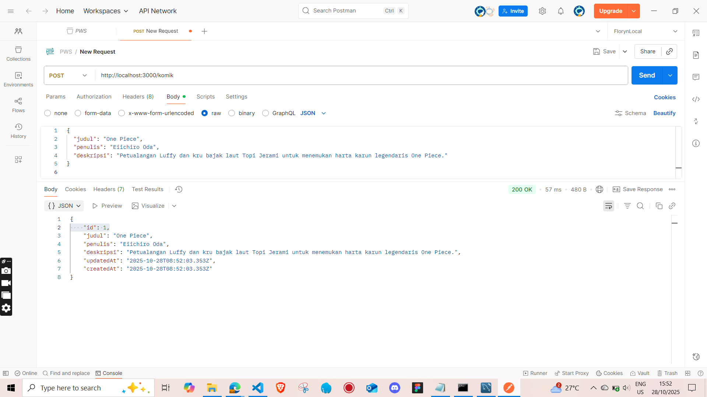
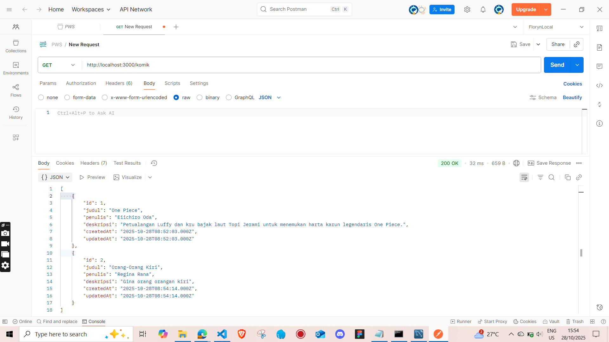
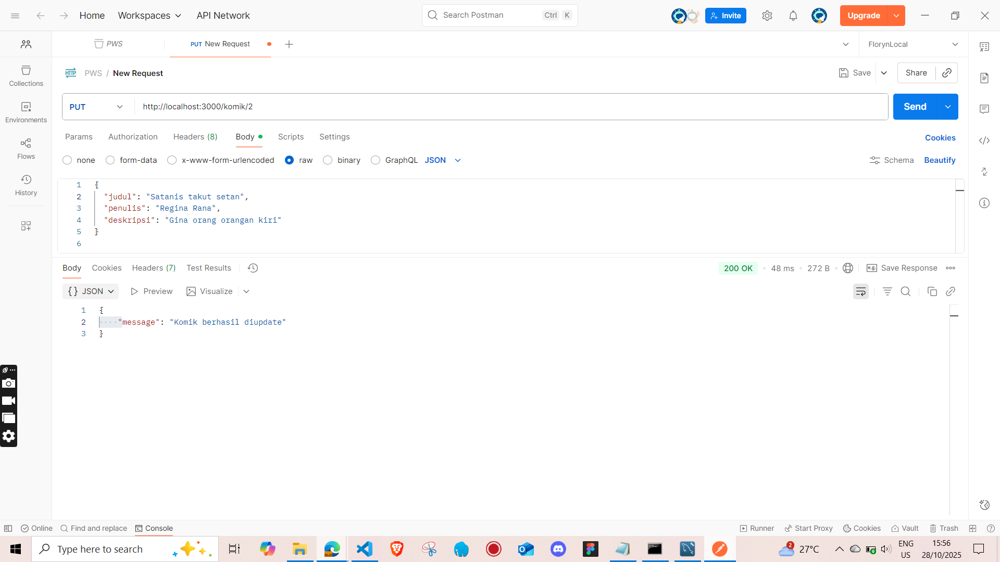

---

## 🧩 Endpoint API

| Method | Endpoint        | Deskripsi                           | Contoh Tangkapan Layar |
|:-------|:----------------|:------------------------------------|:------------------------|
| **POST** | `/komik`        | Menambahkan data komik baru.        |   |
| **GET**  | `/komik`        | Menampilkan seluruh data komik.     |     |
| **PUT**  | `/komik/:id`    | Mengubah data komik berdasarkan ID. |     |
| **DELETE** | `/komik/:id`  | Menghapus data komik berdasarkan ID.|  |

---

## 💾 Contoh Struktur Data Komik

```json
{
  "judul": "One Piece",
  "penulis": "Eiichiro Oda",
  "deskripsi": "Petualangan Luffy dan kru bajak laut Topi Jerami."
}
